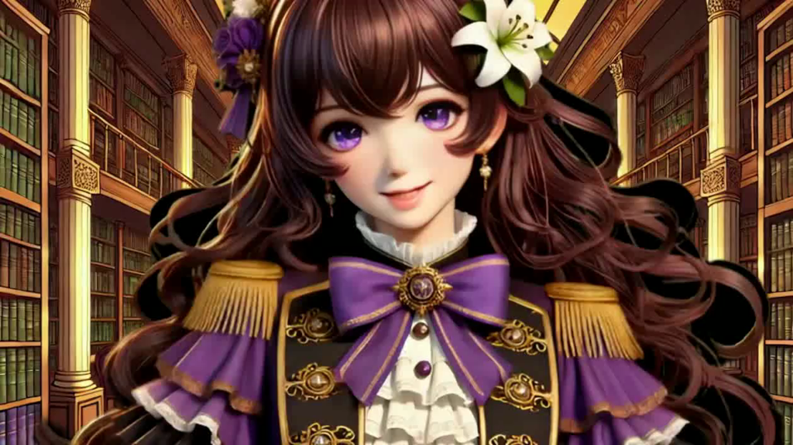

# Story Character Video Chat  




Talk with anime/manga/book characters using Pipecat. Join a videocall with Lyra, from Vampire Mafia Princess.

Let us know what other features you'd like us to add or types of characters we should add into our collecton.

## Get started

```python
python3 -m venv venv
source venv/bin/activate
pip install -r requirements.txt

cp env.example .env # and add your credentials

```

## Run the server

```bash
python server.py
```

Then, visit `http://localhost:7860/start` in your browser to start a chatbot session.

## Build and test the Docker image

```
docker build -t chatbot .
docker run --env-file .env -p 7860:7860 chatbot
```
